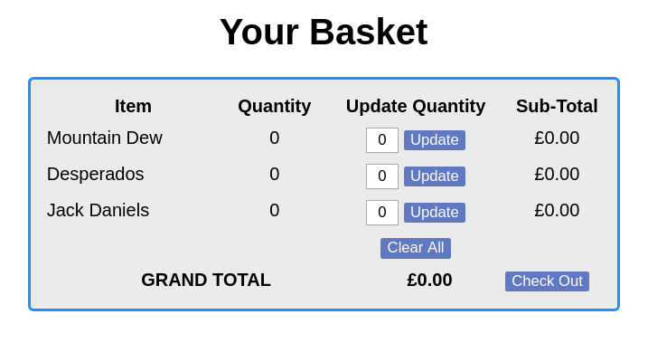
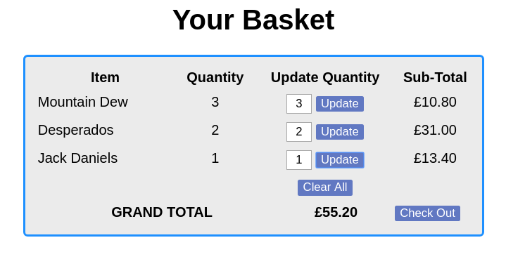
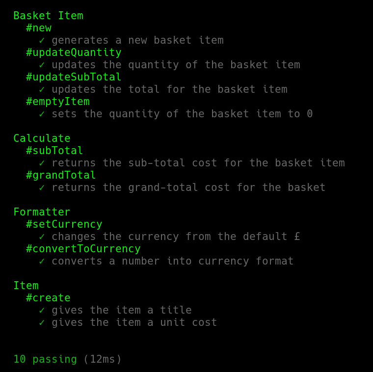

# Shopping Basket

## Introduction
This is a shopping basket created as part of a tech test. It has been made using JavaScript & Node.js without jQuery.

The app allows you to update the quantities of the items in the basket, and will automatically re-calculate the sub-totals and grand total costs.

## Screenshots
### Initial Display

## Updated Quantities

## Approach
1. Diagramming and domain modelling was first done to plan the layout of the code and its features.
2. I decided that the MVP should be all the features as outlined in the User Stories originally provided.
3. A Test Driven Development approach (Red, Green, Refactor) was followed throughout to produce the app, which allowed for a feature by feature implementation. The Mocha, Chai and Sinon frameworks/libraries were used for this.
4. As a result, this also allowed for SOLID and DRY principles to be followed throughout, although this could be improved in some areas.
5. Only once the MVP had been reached was CSS applied thoroughly to the app.

## Class Responsibilities
**Item** - Responsible for creating a shopping item
**Calculate** - Responsible for calculating the basket totals
**BasketItem** - Responsible for manipulating the values for each basket line-item
**Formatter** - Responsible for converting the values to a currency format

## Installing
1. Clone this repo `git clone https://github.com/julesnuggy/shopping_basket.git`
2. Install [Docker](https://www.docker.com/community-edition)
3. Install [Node.js](https://nodejs.org/en)
4. Install docker-compose: `npm install docker-compose`
5. Run `docker-compose build`
6. Run `docker-compose up`
7. Open http://localhost:8080
8. If this doesn't work (e.g. you get an error about the container already being used) then: run `npm install` -> `npm start` -> open  http://localhost:8080

## Testing
1. Run `npm test` in your Terminal

## Project Implementation
1. Initial domain model and diagram
2. Created Item test and class
3. Created Calculate test and class
4. Initial implementation of these in index.html
5. Updated domain model and diagram
6. Created BasketItem test and class
7. Updated index.html implementation
8. Refactored to implement dynamic value updating using SessionStorage
9. Updated tests, classes and index.html implementation
10. Created Formatter test and class
11. Updated index.html implementation

## Greatest Challenge
- Working out how to dynamically adjust values without using jQuery.
- Originally considered creating a route using Express to persist the data but this seemed inefficient for the purpose of the tech test.
- Finally solved by using SessionStorage objects.

## If I Had More Time
1. Draw up domain model
2. Feature testing using Zombie
3. DRYing out in index.js as there is a lot of repetition in the updating of the HTML element values. Another class could be created for this.
4. Properly implement constraints for the item quantities (remove leading zeroes, prevent invalid entries, etc.)
